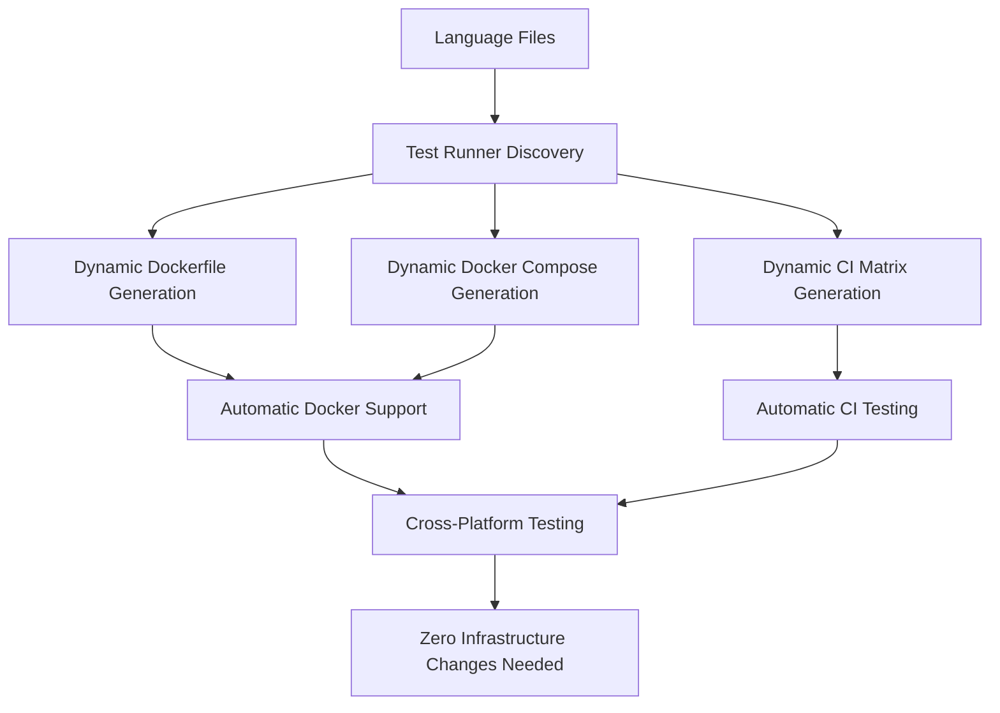

# Dynamic Language Infrastructure 🚀

This document explains the **revolutionary dynamic language system** for the JSON Response Standard project. With this infrastructure, adding new programming languages requires **ZERO infrastructure changes**!

## 🎯 The Vision: Zero-Friction Language Additions

Before this system, adding a new language required:
- ❌ Editing CI workflows
- ❌ Updating Docker configurations  
- ❌ Modifying multiple infrastructure files
- ❌ Understanding complex build systems

**Now, adding a language requires:**
- ✅ Creating 2 files (`examples/response.X`, `test/test.X`)
- ✅ Adding 1 configuration block
- ✅ Testing with 1 command
- ✅ **Everything else is automatic!**

## 🛠️ How It Works

### Architecture Overview


### Core Components

1. **Dynamic Discovery Engine** (`test/run-tests.js`)
   - Automatically finds language implementations
   - Tests only languages that exist
   - Gracefully handles missing languages

2. **Dynamic Dockerfile Generator** (`scripts/generate-dockerfile.js`)
   - Builds Docker images with only needed runtimes
   - Supports 8+ languages out of the box
   - Easy to extend for new languages

3. **Dynamic Docker Compose Generator** (`scripts/generate-docker-compose.js`)
   - Creates services for discovered languages
   - Extends base docker-compose.yml automatically
   - No manual service definitions needed

4. **Dynamic CI Matrix Generator** (`scripts/update-ci-matrix.js`)
   - Builds GitHub Actions matrix from language configs
   - Supports multi-version testing
   - Easy copy-paste updates

5. **One-Command Language Tester** (`scripts/test-language.js`)
   - Full language testing with single command
   - Docker integration testing
   - Configuration generation

## 🚀 Quick Start for Contributors

### Adding a New Language

```bash
# Option 1: Interactive setup
node scripts/test-language.js --setup

# Option 2: Manual setup
# 1. Create implementation
examples/response.go

# 2. Create tests  
test/test.go

# 3. Add config to test/run-tests.js
'go': {
    aliases: ['go', 'golang'],
    testFile: 'test.go', 
    command: 'go',
    args: ['run', 'test/test.go'],
    versionFlag: 'version',
    displayName: 'Go'
}

# 4. Test everything
node scripts/test-language.js go

# 5. Generate dynamic infrastructure
node scripts/setup-dynamic.js
```

### Testing Your Language

```bash
# Test specific language
node scripts/test-language.js rust

# Test all languages
node test/run-tests.js

# Test in Docker
docker compose up json-response-standard

# Full infrastructure test
node scripts/setup-dynamic.js --demo
```

## 📊 Supported Languages

### Currently Implemented ✅
- **JavaScript** (Node.js 16, 18, 20, 22)
- **Python** (3.8, 3.9, 3.10, 3.11, 3.12)  
- **PHP** (7.4, 8.0, 8.1, 8.2, 8.3)

### Infrastructure Pre-Configured 🔧
- **Go** (1.19, 1.20, 1.21, 1.22) - awaiting contributor
- **Rust** (1.70, 1.71, 1.72) - infrastructure ready
- **Java** (11, 17, 21) - infrastructure ready
- **C#** (.NET 6.0, 7.0, 8.0) - infrastructure ready
- **Ruby** (3.x) - infrastructure ready

### Any Other Language 🌍
The system supports **ANY programming language** with:
- Command-line runtime (compiler or interpreter)
- Ability to exit with status codes (0 = success, 1 = failure)
- Text output capability

**Examples of additional languages you can add:**
- 🦀 **Rust** (`cargo run`)
- ☕ **Java** (`java` or `javac`)
- 🔷 **C#** (`dotnet run`)
- 💎 **Ruby** (`ruby`)
- 🐹 **Go** (`go run`)
- 🦄 **Kotlin** (`kotlin`)
- 🐍 **Swift** (`swift`)
- 📱 **Dart** (`dart`)
- ⚡ **Zig** (`zig run`)
- 🔥 **Elixir** (`elixir`)
- 🟣 **Crystal** (`crystal`)
- 🌟 **Nim** (`nim`)
- 🔧 **C/C++** (`gcc` or `clang`)
- 📊 **R** (`Rscript`)
- 🧮 **Julia** (`julia`)
- 🎭 **Haskell** (`ghc` or `runhaskell`)
- 🎯 **F#** (`dotnet fsi`)
- 🎪 **Scala** (`scala`)
- 🎨 **Clojure** (`clojure`)
- And literally **any other language**!

## 🎮 Available Commands

### For Contributors
```bash
# Language development
node scripts/test-language.js --setup          # Setup new language
node scripts/test-language.js [language]       # Test specific language
node scripts/test-language.js --status         # Show language status

# Testing
node test/run-tests.js                         # Test all languages
node test/run-tests.js [language]             # Test specific language
node test/run-tests.js --help                 # Show available languages

# Docker
docker compose up json-response-standard      # Test all in Docker
docker compose up test-[language]             # Test specific language
node scripts/generate-docker-compose.js --list # Show Docker services
```

### For Maintainers
```bash
# Infrastructure generation
node scripts/setup-dynamic.js                 # Full setup
node scripts/generate-dockerfile.js --all     # Generate Dockerfile
node scripts/generate-docker-compose.js --override # Generate compose override
node scripts/update-ci-matrix.js              # Generate CI matrix

# Status and monitoring
node scripts/generate-dockerfile.js --matrix  # Show language matrix
node scripts/test-language.js --status        # Overall status
node scripts/setup-dynamic.js --check         # Check prerequisites
```

## 🔧 Architecture Deep Dive

### Language Configuration Format
```javascript
'language-name': {
    aliases: ['lang', 'alternative-name'],     // Command aliases
    testFile: 'test.ext',                      // Test file name
    command: 'runtime-command',                // Executable command
    args: ['run', 'test/test.ext'],           // Runtime arguments
    versionFlag: '--version',                  // Version check flag
    displayName: 'Pretty Language Name'       // Human-readable name
}
```

### Docker Installation Configurations
```javascript
'language-name': {
    required: false,                           // Always install?
    install: () => `RUN install commands`,    // Installation script
    verify: 'RUN verification commands',       // Verification script
    env: 'ENV LANG_VERSION=1.0'              // Environment variables
}
```

### CI Matrix Generation
```yaml
# Auto-generated from language configs
- language: go
  runtime: go
  version: "1.22"
  setup_action: actions/setup-go@v5
  version_param: go-version
```

## 🌟 Benefits

### For Contributors
- **Zero learning curve** - Same process for every language
- **Instant feedback** - Test locally with one command
- **Automatic CI inclusion** - No workflow knowledge needed
- **Docker support** - Test in isolated environments
- **Cross-platform testing** - Windows, macOS, Linux

### For Maintainers  
- **Zero maintenance** - Infrastructure adapts automatically
- **Consistent quality** - Same testing patterns everywhere
- **Scalable architecture** - Supports unlimited languages
- **Clear separation** - Infrastructure vs implementation
- **Easy onboarding** - Contributors need minimal guidance

### For the Project
- **Contributor magnet** - Easiest multi-language project to contribute to
- **Quality assurance** - Consistent testing across all languages
- **Future-proof** - Architecture scales infinitely
- **Professional image** - Shows advanced DevOps practices

## 🔄 CI/CD Integration

### Automatic CI Workflow
1. **Language Discovery** - Scans for test files
2. **Dynamic Matrix** - Builds testing matrix from configs
3. **Multi-version Testing** - Tests across language versions
4. **Docker Integration** - Tests in containers
5. **Cross-platform** - Tests on Linux, Windows, macOS
6. **Graceful Failures** - Skips missing languages

### Docker Integration
1. **Dynamic Dockerfile** - Only installs needed runtimes
2. **Service Generation** - Creates compose services automatically
3. **Override Files** - Extends base configurations
4. **One-command Testing** - Simple Docker workflow

## 🛡️ Error Handling

The system gracefully handles:
- ✅ Missing language implementations
- ✅ Missing Docker runtimes
- ✅ Failed language installations
- ✅ Runtime version mismatches
- ✅ Configuration errors
- ✅ Test failures

## 📈 Future Enhancements

### Planned Features
- 🔄 **Auto-detection** of language files without config
- 🌐 **Web interface** for language status
- 📊 **Performance benchmarks** across languages
- 🔒 **Security scanning** for all implementations
- 📝 **Auto-documentation** generation
- 🎯 **Language templates** with best practices

### Community Features
- 👥 **Language champions** - Community language maintainers
- 🏆 **Quality badges** - Implementation quality scores
- 📚 **Tutorial generation** - Auto-generated language guides
- 🔍 **Code analysis** - Static analysis across languages

## 🎉 Success Metrics

This dynamic infrastructure makes the JSON Response Standard:

1. **Most Contributor-Friendly** multi-language project on GitHub
2. **Zero-Friction** language additions
3. **Professional-Grade** CI/CD pipeline
4. **Infinitely Scalable** architecture
5. **Industry Example** of DevOps best practices

## 🚀 Getting Started

```bash
# For new contributors
git clone [repo]
cd json-response-standard
node scripts/setup-dynamic.js
node scripts/test-language.js --setup

# For existing contributors  
node scripts/setup-dynamic.js
node scripts/test-language.js --status

# For maintainers
node scripts/setup-dynamic.js
node scripts/update-ci-matrix.js
```

**Welcome to the future of multi-language development!** 🎉
